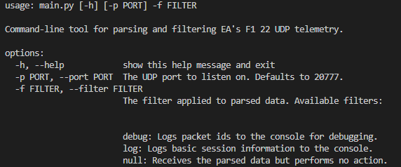
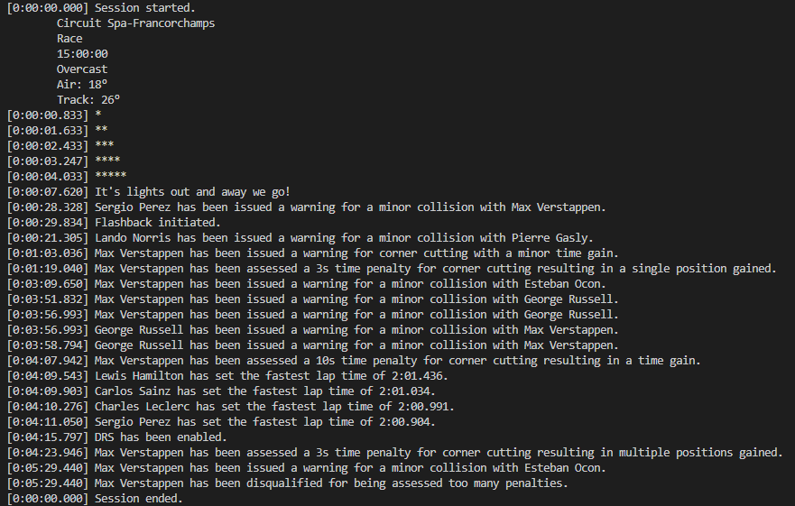

<h1>About</h1>
<p>A Python-based command-line tool for parsing F1 22's UDP telemetry: specifically designed to be easy to install, use and extend.</p>
<p>The basic operation of the application is to listen for UDP packets on the given port, turn those data packets into a Packet type in the application, then queue those typed packets for a filter to process further.</p>
<p>Packet types are defined in accordance with <a href='https://answers.ea.com/t5/General-Discussion/F1-22-UDP-Specification/td-p/11551274'>EA's packet specification</a>.</p>
<p>The parser was originally developed for a companion project, a <a href="https://github.com/kens-git/race_replay">React-based race replay tool</a>.</p>


<h1>Installation</h1>
<p>The application doesn't require any third party packages: a recent (3.9+) installation of Python is all that is required. For complete beginners, the code can be downloaded from this page as a zip file (click on the green 'Code' button, then select 'Download ZIP').</p>
<p>To actually receive telemetry data a copy of F1 22 for PC with telemetry output turned on is also required.</p>

<h1>Examples</h1>
<h4>Showing the help text:</h4>

```
python ./main.py -h
```


<br/><br/>
<h4>Using LogFilter with the default port (20777):</h4>

```
python ./main.py -f log
```

<h4>Using DebugFilter with a specific port:</h4>

```
python ./main.py -f debug -p 25000
```

<p>Use Ctrl+C in the command-line window to stop the application.</p>

<h1>Preview</h1>
<p>The LogFilter during a short session:</p>



<h1>Extending</h1>
<p>The application is easy to extend with new filter types by:</p>
<ol>
    <li>Subclassing the filters.Filter class.</li>
    <li>Implementing the desired filter_* method(s). Each method corresponds to a specific packet type, so the packet types of interest can be received by implementing the method for that packet. The cleanup method is meant to give the filter a chance
    to clean up or commit any work it has done before the application closes as the result of a key interrupt (e.g., if it's working with files), but this method can be ignored if it's not applicable.</li>
    <li>Adding the new filter in the FILTERS dictionary in main.py. This makes it available for selection from the command line. Note: currently, filters are expected to take no parameters in their constructors.</li>
    <li>Run the application, selecting your new filter.</li>
</ol>

<p>The LogFilter serves as an example for how a filter may be implemented.</p>

<p>Note: filters may lag when the telemetry rate is high, but the queue should ensure all data is eventually filtered. If a real-time filter is required, invoking main.py using PyPy appears to be the most straightforward solution.</p>

<h1>Running Tests</h1>
<p>Depending on your platform/terminal, run either the Powershell or Bash run_tests script.</P>
<p>The script simply invokes unittest's discover option and runs the tests but does it from the root directory to prevent complaints about module imports caused by running discover from other directories.</p>
